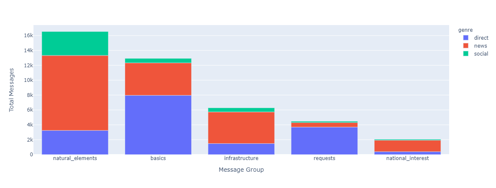
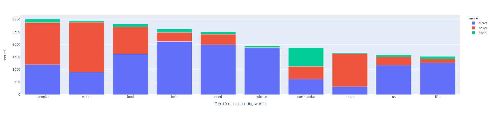

# Disaster Response Pipeline

Imagine the number of messages sent during a disaster. Imagine a response team waiting to respond to a disaster but has no way to knowing the reality in real time.

Since information these days flows through a variety of mediums and it is important to have a system that can funnel that information into a single repository, from where it could then be sent out to the relevant response teams based on the classification of the messages.

E.g. Information about a fire breaking out in a particular area can be collected from social media, news platforms and other sources and then sent to the fire response teams so they have the relevant to them as and when it happens. Or information about a bridge collapse could be classified and the rescue department could be updated with the followup information as well.

## Files
```
root
|
+-- app
|   +-- template
|   |   |-- master.html   # main page of web app
|   |   |-- go.html       # classification result page of web app
|   |
|   |-- run.py            # Flask file that runs app
|
+-- data
|   |-- disaster_categories.csv   # data to process
|   |-- disaster_messages.csv     # data to process
|   |-- process_data.py           # performs ETL on the csv data and generates the db file
|   |-- etl_pipeline_database.db  # database to save clean data to
|
+-- models
|   |-- train_classifier.py    # trains the model/pipeline 
|   |-- classifier.pkl         # saved model
|
+-- img
|   |-- graph_1.png      # snapshot of the macro category graph
|   |-- graph_2.png      # snapshot of the Top 10 words graph
|
README.md

```

- The `data` folder contains the CSV files, `disaster_messages.csv` and `disaster_categories.csv` which contain the messages information and the categories information respectively, the python script [process_data.py](./data/process_data.py) to process the CSV files, and the SQLite database file `etl_disaster_pipeline.db` which contains the cleaned up data. The data from the CSV files is formatted and merged into one table 

- The `models` folder contains the python script [train_classifier.py](./models/train_classifier.py)to train the model based on the CSV data and a Pickle file `classifier.pkl` which contains the trained model. The model is a pipeline consisting of a CountVectorizer, TfIdfTransformer and a RandomForestClassifier passed to a MultiOutputClassifier

- The `app` folder contains a pythong script [run.py](./app/run.py) which is runs the Flask development web server, and the templates sub-folder contains the template files `indes.html` and `go.html` which are rendered as pages of the webapp. 

The webapp shows two interactive graphs on the home page, one showing the macro categories stacked by `genre` of the message sent. 
- Natural Elements sums up the Weather, Flood, Storm, Fire, Earthquake, Cold categories. 
- Basics sums up the Water, Shelter, Clothing, Food, Electricty, Money categories.
- Infrastructure sum up the Transport, Buildings, Hospitals, Shops, Aid Centers, Buildings categories. 
- Requests is the Requests category. The National Interest sums up the Search and Rescue, Security, Military Aid categories.

The above are sorted by the total number of messages classified across all genres.


The second graph shows the Top 10 occuring words stacked by `genre`, sorted by the total number of messages classified across all genres.


## Commands
Run the following from the project folder.
```
# To create the database with the cleaned up data
python ./data/process_data.py ./data/disaster_messages.csv ./data/disaster_categories.csv ./data/<db_name>.db

# To train and save the pkl model
python ./models/train_classifier.py ./data/<db_name>.db ./models/classifier.pkl

# To deploy the application locally
python ./app/run.py
```

## Views

### ETL

- The category columns are to have either `1` or `0` indicating whether a message belongs to that category or not. Few values of the `related` category had a value of `2`. Inspecting the corresponding message text revealed incoherent, un related message texts, and all the other category columns had a value of `0`. So the value of 2 was replaced with `0`
- Even though the values are `1` and `0`, they are essentially categorical values of `Yes` and `No`, both of which are important for training. Hence, any row or column (e.g. `child_alone`) with all `0s` should be left as it is and not deleted.
- There are some messages with contained UTF encodings of Thai characters. They were left as they were for this project.

### Training - Fitting
- The `ngram_range` parameter of `CountVectorizer` with a value of `(3, 3)` gives on more descriptive 'phrases' since there are three words instead of the the default 1 word. E.g. 'Please help us', 'need food water'. Which would be better for training would have be verified using the `GridSearchCV`.

### Webapp
- There was strong relation between the `genre` of the messages and the words used in the messages. E.g. 'Food', 'help', 'need', 'please' appeared maximum in the `direct` genre
- The `max_features` parameter of `CountVectorizer` was used with a value of `10` to get the Top 10 words in all of the messages. But since a "document" in this dataset, is only a message, and a word might only appear once in a message, it could be more useful to use `min_df` and then to get the Top 10 words from the results, since a single word can appear in multiple messages.

### Optimization
- The 'cleanup' process of URLs, punctuations, stop words and lemmatizing which currently is happening in the tokenization stage of the `CountVectorizer` can be done in the Transform stage of the ETL, and only the cleaned up words for each message can be stored in SQLite database. This would save on space for the database, and should also speedup the `CountVectorizer.fit_transform` function, since there is one less step to perform. 
 There was an attempt to perform this, but we are still left with `.` and `'` which then end up being tokenized. This needs to be investigated further.
